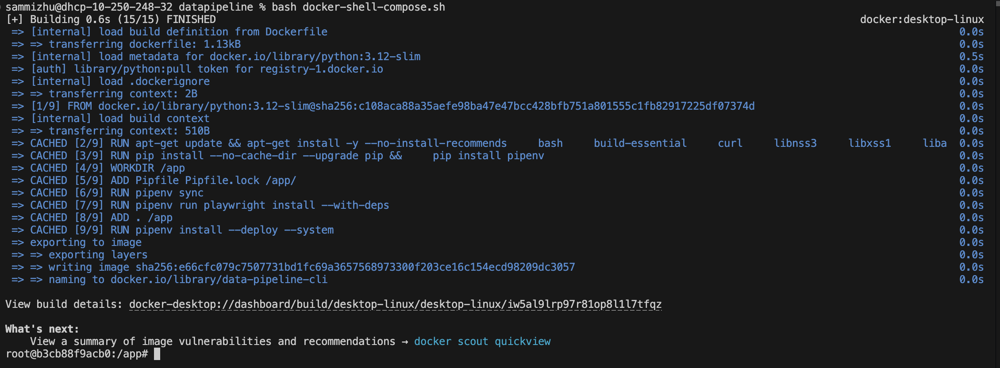

# AC215 - Milestone4 - PrivaSee

**Team Members** Glo Umutoni, Shira Aronson, Aditi Raju, Sammi Zhu, Yeabsira Mohammed

**Group Name** PrivaSee

------------------------
### Milestone4
In this milestone, we have the components for frontend, API service, and components from previous milestones for data management, versioning, and language models.

After building a ML Pipeline in our previous milestone, we have built a backend api service and frontend app. This will be our user-facing application that ties together the various components built in previous milestones.

**Application Design** 

We designed both a Solution Architecture and a Technical architecture to ensure all components of our app work together. 

Here is our Solution Architecture:

[TODO: INSERT DIAGRAM --> see https://github.com/ac2152024/ac2152024_template/tree/milestone4]

Here is our Technical Architecture:

[TODO: INSERT DIAGRAM --> see https://github.com/ac2152024/ac2152024_template/tree/milestone4]

**Backend API** 

We used fast API to build the backend service. This exposes the model functionality to the frontend.

**Frontend** 

A React app was built to identify privacy issues in terms and conditions using a trained Gemini model on the backend. On the app, a user can upload terms and conditions and receive a summary of key issues and a privacy grade: the app sends the pdf to the backend api to get classification results. Additionally, a user can request app recommendations using natural language. For now, running the React app locally requires installing modules listed in `requirements.txt` and `npm-requirements.txt`. These setup requirements will be containerized and abstracted away from the user once the website is deployed.

To actually run the React app locally, there are two steps: 

1. In `src/frontend-react`: run `npm install` and `npm run dev`. If issues arise, check that `npm --version = 10.8.3` and `nvm --version = 22.9.0`
2. In `src/api_service`: run `uvicorn api.service:app --reload --host 0.0.0.0 --port 9000`

Here are some screenshots of our app:

#### Running Docker
To run Dockerfile in either container, make sure to be in `/src/desired-container`:

1. Run the command `bash docker-shell.sh`
2. When set ran correctly, you should expect to see the following as demonstrated in the screenshot.

### Notebooks/Reports
Both folders here contains code that is not part of the container. Notebooks contains the original `.ipynb` files used to run the code, however, are also converted into `.py` files in the containers. Reports contains the write up from previous milestones. 

### Midterm Presentation <mark>*New*</mark>
Filename: midterm_presentation/PrivaSee_Midterm.pdf
