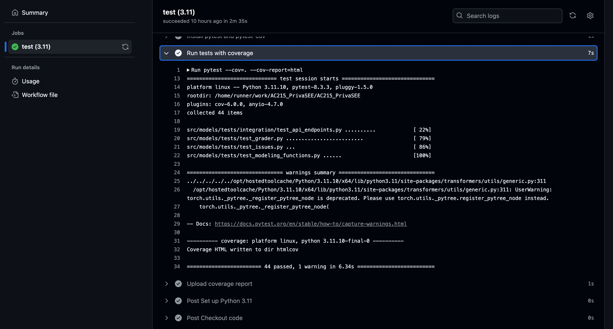

# AC215 2024 PrivaSee
**Team Members** Glo Umutoni, Shira Aronson, Aditi Raju, Sammi Zhu, Yeabsira Mohammed

**Group Name** PrivaSee

**Project** Project When deciding on a messaging app, for example, the average consumer is unlikely to read or understand the terms and conditions of multiple apps and decide which one to use accordingly. This project aims to bridge consumers’ knowledge gaps around their data privacy by building an app that reviews terms and conditions agreements and informs users about the aspects of the privacy they cede by using a certain app or website. PrivaSEE would allow users to understand the implications to their data privacy, and compare options in a way that aligns with their personal privacy priorities.

## Project Organization
See below for the organizational structure of the project. Containerizations are elaborted upon (note that Dockerfiles and additional bashscripts and pyenv files exist but have been omitted from overview for brevity). Additional files can be found in the codebase directory. 
```
├── midterm_presentation
├── notebooks
├── reports
└── src
    ├── api-service/
    │   ├── api/
    │   │   ├── routers
    │   │   ├── utils
    │   ├── service.py
    ├── datapipeline/
    │   ├── clean_data_for_recommendations.py
    │   ├── clean_data.py
    │   ├── create_gemini_tuning_datasets.py
    │   ├── create_vertexai_datasets.py
    │   ├── get_data_for_recommendations.py
    │   └── scraping_prototype.py
    ├── deployment/
    ├── frontend-react/
        │   ├── public/
        │   ├── src/
        │   │   ├── app/
        │   │   │   ├── about/
        │   │   │   ├── recommend/
        │   │   │   ├── summarize/
        │   │   │   ├── auth.js
        │   │   │   ├── global.css
        │   │   │   ├── layout.jsx
        │   │   │   ├── page.jsx
        │   │   ├── components/
        │   │   │   ├── auth/
        │   │   │   ├── chat/
        │   │   │   ├── home/
        │   │   │   ├── layout/
        │   │   ├── services/
        │   │   │   ├── Common.js/
        │   │   │   ├── DataService.js/
    ├── models
    │   ├── tests/
    │   ├── category_weights.csv
    │   ├── get_issues.py
    │   ├── modeling_functions.py
    │   ├── multi_class_model.py
    │   └── privacy_grader.py
    └── workflow
├── LICENSE
├── README.md
```

## Prerequisites and Setup Instructions
Please see below on different methods to set up and run the application. General packages used are also listed as in `requirements.txt` for ease of comparison with user's local package versions. However, this step is truly optional as the Dockerfile is configured via Pipfile to install the same dependices. 

### Running Docker
To run Dockerfile in either container, make sure to be in `/src/desired-container`:

1. Run the command `bash docker-shell.sh`
2. When set ran correctly, you should expect to see the following as demonstrated in the screenshot.


### Running Project Locally
1. In `src`: (optional depending on local configuration):
   ```
   pip install -r requirements.txt
2. In `src/frontend-react`: 
   ```bash
   npm install
   npm run dev   
3. In `src/api_service`:
   ```bash
   uvicorn api.service:app --reload --host 0.0.0.0 --port 9000
If issues arise, check that `npm --version = 10.8.3` and `nvm --version = 22.9.0`

### Testing and CI/CD Integration
We implemented Testing and CI/CD integration through Github Actions. Tests can be found in `src/models/tests`. Please see the following screenshot for testing verification.

1. Github Actions Overview


2. Testing Coverage


3. Testing Deployment


4. Testing Success


## Deployment Instructions
Note: The following provides an overview of the setup steps. `.yml` and `Dockerfiles` files can be found in `src/deployment`. For exact steps on what code to run, please visit [here](https://github.com/dlops-io/cheese-app-v3/blob/main/README.md).

### Deployment with Ansible (GCP Virtual Machine)
Run these commands:

1. ansible-playbook deploy-docker-images.yml -i inventory.yml
2. ansible-playbook deploy-create-instance.yml -i inventory.yml --extra-vars cluster_state=present
3. ansible-playbook deploy-provision-instance.yml -i inventory.yml
4. ansible-playbook deploy-setup-containers.yml -i inventory.yml
5. ansible-playbook deploy-setup-webserver.yml -i inventory.yml
6. ansible-playbook deploy-create-instance.yml -i inventory.yml --extra-vars cluster_state=absent

---

### Deployment with Scaling (Kubernetes)
Run these commands:

1. ansible-playbook deploy-docker-images.yml -i inventory.yml
2. ansible-playbook deploy-k8s-cluster.yml -i inventory.yml --extra-vars cluster_state=present


See screenshots below for reference of what scaling verfication should look like on GCP after completion:


## Usage Details and Examples
A React app was built to identify privacy issues in terms and conditions using a trained Gemini model on the backend. The Homepage (shown below) showcases the functionalities of the application and serves as the guide to other pages. 


There are two core functionalities:
### `Summarize:` 
1. Users choose any file from their laptop to upload. 


2. Once loaded, users are given the option to upload their file to the web-application. 


3. A loading bar indicates to users the status of their file loading. Once successfully loaded, users can fetch for a grade.


4. The retrieved data returned maps the privacy issues to one of 22 privacy components (i.e. privacy, governance, etc) along with the overall privacy grade. Bars highlight the counts of various privacy components and the tables provide more description of the specific violations.


### `Recommend:` 
1. Users can use the chatbox to ask for a genre or an app similar to another app, along with the privacy concerns they want the app to be aware of. 


2. A load spin appears while the backend retrieves the output response from the model.


3. The final results are outputed in a chat div format for readers to see what app the model recommended. 


Additionally, there is also an `About` page that further describes the goals of our web application. 


## Known Issues and Limitations

### Model Robustness
Despite setting a consistent temperature parameter to control the randomness of outputs, the model’s responses occasionally lack robustness. This can result in less robust outputs. Further fine-tuning or additional constraints might be required to enhance reliability across all use cases.

### File Upload Time
The time required to upload a file is directly proportional to its size. Larger files, especially those exceeding several megabytes, can result in noticeable delays, potentially impacting user experience. Optimizations in file handling or upload infrastructure could help mitigate this issue in future iterations.

### Variable Model Response Time
The response time for generating outputs from the model can vary depending on the complexity of the input query and server load. While most queries are resolved in a few seconds, users may occasionally experience delays (up to 15 seconds or more).